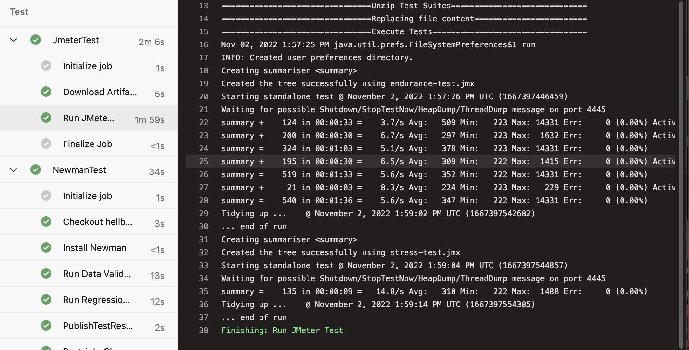

# Ensuring Quality Releases

This repository contains the submission code for the **Ensuring Quality Releases** project of the cd1807 Ensuring Quality Releases (Quality Assurance) course taught by Nathan Anderson.

## Azure Pipeline

## Pre-requisition

To operate on this repo, following actions are required:

* Have an Azure Account
* Install `az cli`
* Login to your Azure account using CLI:

```sh
az login
```

* Build packer images with this [template](/packer/)
* Create a storage account based on this [script](/terraform/environments/test/configure-tfstate-storage-account.sh)
* Add your Azure account to service connection in Azure DevOps project

## Pipeline

Azure pipeline include of 3 stages:

* Build: building infrastructure using Terraform and publish artifact for later stages
* Deploy: deploying Fake Rest API to Azure App Service using ZIP Deployment
* Test: running 3 test suites including: Postman/Newman, JMeter, Selenium

## Monitoring configuration

### App Service Alert

Following this [document](https://learn.microsoft.com/en-us/azure/azure-monitor/alerts/alerts-overview) to create alert for Azure App Services.

### Log Analytics for VM

Following this [document](https://learn.microsoft.com/en-us/azure/azure-monitor/agents/data-sources-custom-logs) to create Custom Logs for VM. Please be patient while waiting for logs to be ingested to Log Analytics

## Results

* [Terraform](/terraform/environments/test/) and screenshot of the log output of Terraform when executed by the CI/CD pipeline


* [Azure Pipeline](/azure-pipelines.yaml) and a screenshot of the successful execution of the pipeline.


* [Postman collections and environment](/automatedtesting/postman/). Three screenshots of the Test Run Results from Postman shown in Azure DevOps. Noticed that the failed status is because some of the environment VMs are offline


* [Selenium Python file](/automatedtesting/selenium/uitest.py) and a screenshot of the successful execution of the Test Suite on a VM in Azure DevOps


* [JMeter test results for each test suites](/automatedtesting/jmeter/test-suites/html_report/). A screenshot of the log output of JMeter when executed by the CI/CD pipeline



* Screenshots of the email received when the alert is triggered, the graphs of the resource that the alert was triggered for (be sure to include timestamps for the email and the graphs), and the alert rule, which will show the resource, condition, action group, alert name, and severity.


* Screenshots of log analytics queries and result sets which will show specific output of the Azure resource. The result set will include the output of the execution of the Selenium Test Suite (be sure to include timestamps).


## Improvement

* The API used in POSTMAN section is really unstable, constantly giving `429 Too Many Requests` error, I would suggest to change the API for testing